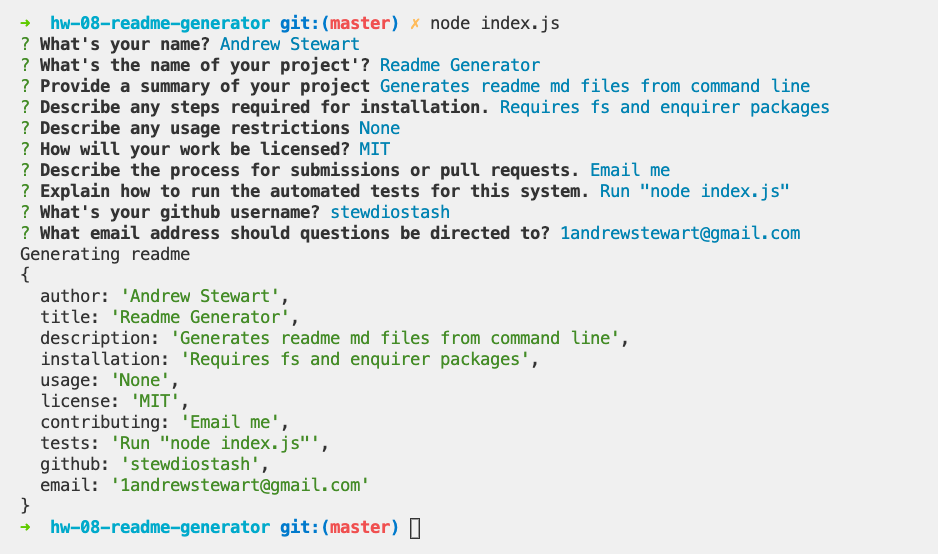

# Readme Generator
## Description
        
The Readme Generator allows users to quickly generate a thorough Readme from the command line by answer a series of questions (enquirer). Responses are first injected into the generateMarkdown.js utility—then written to file via fs.writeFileSync.

## Screenshot

## Table of Contents

* [Description](#description)
* [Screenshot](#screenshot)
* [Installation](#installation)
* [Usage](#usage)
* [License](#license)
* [Contributing](#contributing)
* [Tests](#tests)
* [Questions](#questions)

## Installation

Requires fs and enquirer packages

## Usage

None

## License

MIT
Copyright (c) 2020 Andrew Stewart

## Contributing

Email me

## Tests

Run "node index.js"

## Questions
https://github.com/stewdiostash

1andrewstewart@gmail.com

